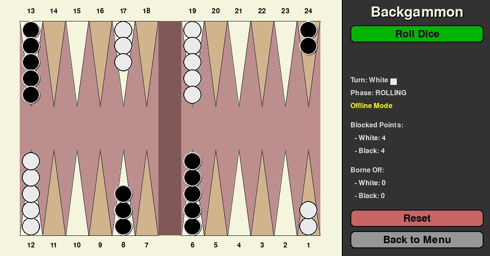

# Backgammon

A classic Backgammon game implemented in Python using the Pygame library. This project features a graphical user interface (GUI), standard game rules, offline play, and LAN multiplayer functionality.

## Features

*   **Graphical User Interface:** Visual representation of the board, checkers, dice, and UI elements powered by Pygame.
*   **Standard Backgammon Rules:** Implements core Backgammon rules including movement, hitting, bearing off, and handling the bar.
*   **Offline Mode:** Play a game locally (controlling both players) for practice or testing.
*   **LAN Multiplayer:** Play against another person on the same local network.
    *   **Host Game:** Start a game session and wait for an opponent to join.
    *   **Join Game:** Connect to a game hosted by someone else on the network.
*   **Visual Feedback:**
    *   Dice rolling animation.
    *   Highlighting valid moves for the selected checker.
    *   Display of game state (current player, phase, time, connection status).
*   **Game Controls:** Reset the game or return to the main menu via sidebar buttons.

## Screenshots




## Dependencies

*   **Python 3.x**
*   **Pygame:** A cross-platform set of Python modules designed for writing video games.

## Installation

1.  **Clone the repository:**
    ```bash
    git clone https://github.com/davidgomari/Backgammon
    cd Backgammon
    ```
2.  **Install dependencies:**
    It's recommended to use a virtual environment.
    ```bash
    # Create and activate a virtual environment (optional but recommended)
    python -m venv venv
    # On Windows:
    .\venv\Scripts\activate
    # On macOS/Linux:
    source venv/bin/activate

    # Install Pygame
    pip install pygame
    ```
    *(Alternatively, you could create a `requirements.txt` file with `pygame` listed and use `pip install -r requirements.txt`)*

## How to Run

Make sure you are in the project's root directory (where `main.py` is located) and have your virtual environment activated (if used).

```bash
python main.py
```

## How to Play

### Objective

The goal of Backgammon is to move all 15 of your checkers around the board and bear them off (remove them from the board) before your opponent does. White moves counter-clockwise from point 1 towards point 24, while Black moves clockwise from point 24 towards point 1.

### Gameplay Basics

1.  **Starting:** The game starts with a standard setup. White plays first.
2.  **Rolling:** Click the "Roll Dice" button on your turn.
3.  **Moving:**
    *   The numbers rolled on the two dice indicate how many points (pips) you can move your checkers.
    *   You can move one checker for each die roll, or one checker for the total of both dice (if moving step-by-step is legal).
    *   Click on one of your checkers to select it. Valid destination points will be highlighted.
    *   Click on a highlighted destination point to move the checker.
    *   **Doubles:** If you roll doubles (e.g., 5-5), you get to move four times by the number rolled (four moves of 5 pips).
    *   **Hitting:** If you land on a point occupied by a single opponent checker (a "blot"), that checker is "hit" and moved to the bar in the middle of the board.
    *   **Blocked Points:** You cannot land on a point occupied by two or more opponent checkers.
    *   **Bar:** If you have checkers on the bar, you *must* bring them back into play in the opponent's home board before moving any other checkers. The dice roll determines the entry point (1 for point 24/1, 6 for point 19/6, depending on color).
    *   **Bearing Off:** Once all 15 of your checkers are in your home board (points 19-24 for White, 1-6 for Black), you can start bearing them off. A die roll allows you to move a checker off the board if the roll corresponds exactly to the point number (e.g., roll a 3 to bear off from point 3/22) or if the roll is higher than the highest occupied point (but only if no checkers are on higher points).
4.  **Winning:** The first player to bear off all 15 checkers wins.

### Game Modes

*   **Offline Mode:**
    *   Select "Play Offline" from the main menu.
    *   You control both White and Black turns.
*   **Network Play (LAN):**
    *   **Hosting:**
        *   Select "Host Game (LAN)".
        *   You can optionally specify which of your local IPs to host on and change the port (default 5555). Leaving the IP blank usually works.
        *   Click "Start Hosting". Your IP address(es) will be shown for the joining player to use.
        *   Wait for the opponent to connect. The game starts automatically once they join. The host is always White (Player 1).
    *   **Joining:**
        *   Select "Join Game (LAN)".
        *   Enter the IP address provided by the host.
        *   Click "Join". If successful, the game will start. The joining player is always Black (Player -1).

### Controls

*   **Roll Dice:** Click the button in the sidebar when it's your turn and the game phase is 'ROLLING'.
*   **Select Checker:** Click on one of your checkers during the 'MOVING' phase.
*   **Move Checker:** Click on a valid highlighted destination point after selecting a checker.
*   **Reset Game:** Click the "Reset" button in the sidebar (only works in offline mode or if you are the host).
*   **Back to Menu:** Click the "Back to Menu" button in the sidebar to end the current game and return to the main menu. This will disconnect network games.

## Code Structure

*   `main.py`: The main entry point of the application. Initializes and runs the `App`.
*   `app.py`: Contains the main `App` class which manages the game loop, event handling, switching between game phases (menu, playing, hosting, joining), and coordinates the UI, Game logic, and Network components.
*   `game.py`: Defines the `Game` class, encapsulating the board state, checker positions, dice, current player, game rules logic (move validation, making moves, checking win conditions), and state serialization.
*   `network.py`: Implements the `Network` class for handling TCP socket communication between the host and client for LAN multiplayer, including sending and receiving game state.
*   `ui.py`: Contains all functions related to drawing the game elements using Pygame (board, checkers, sidebar, menus, buttons, dice, input boxes) and UI constants (colors, dimensions, positions).
*   `background.png`: Background image used for the main menu.
